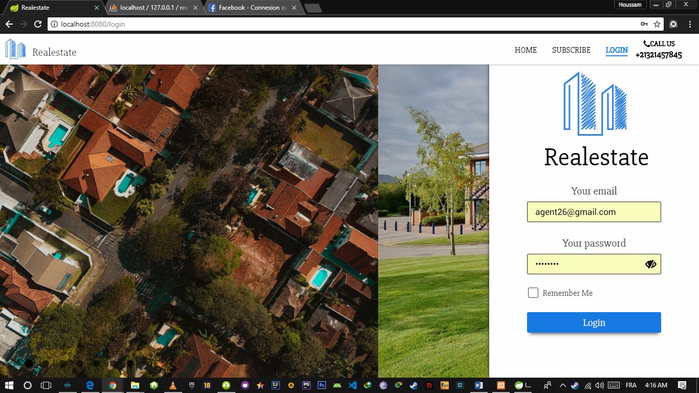
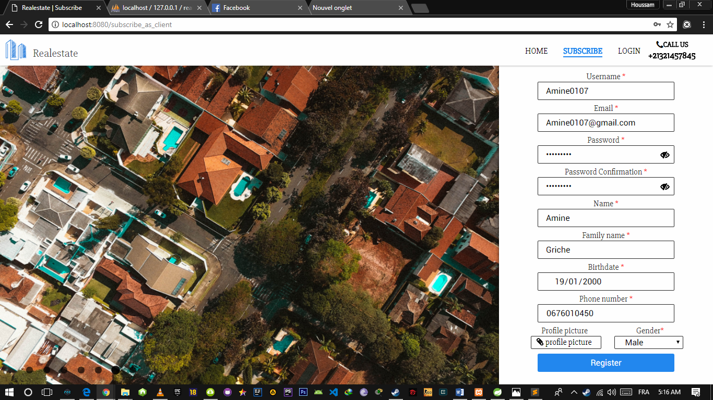
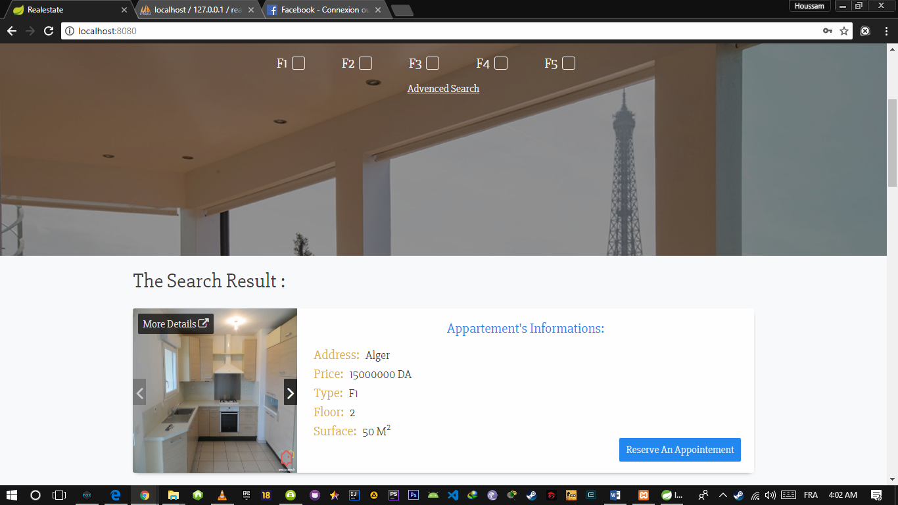
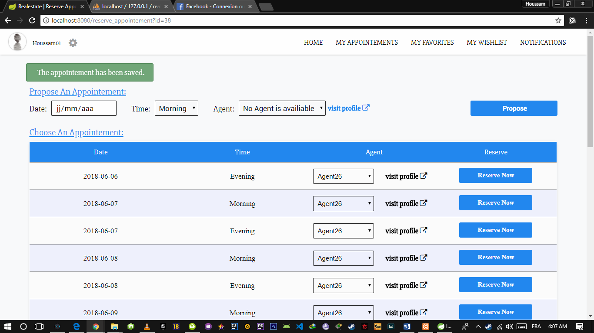
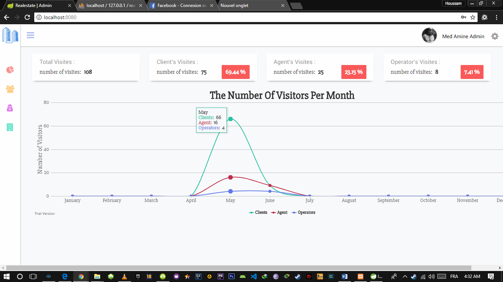
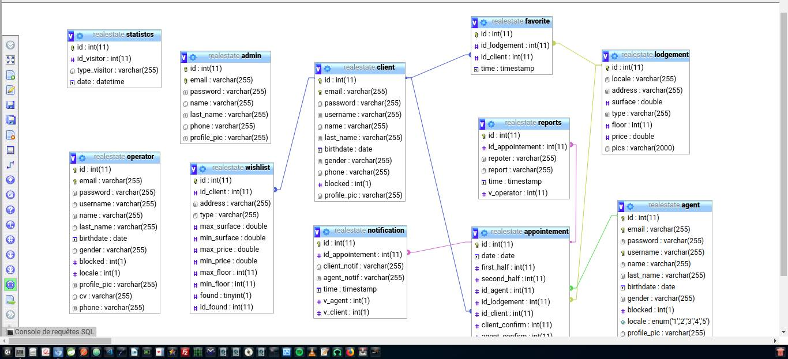

# realestate
  A  Realestate Selling Web Application usign Spring Framework for the back-end and Thymeleaf in the front-end

## App Interfaces
  
  - Authentication :
       
      
      
  - Subscription :
       
      
      
  - The Search :
       
      
       
      
      
  - Appointement :
       
      
      
  - Admin Dashboard :
       
      

  - Database: 
      
  
  
